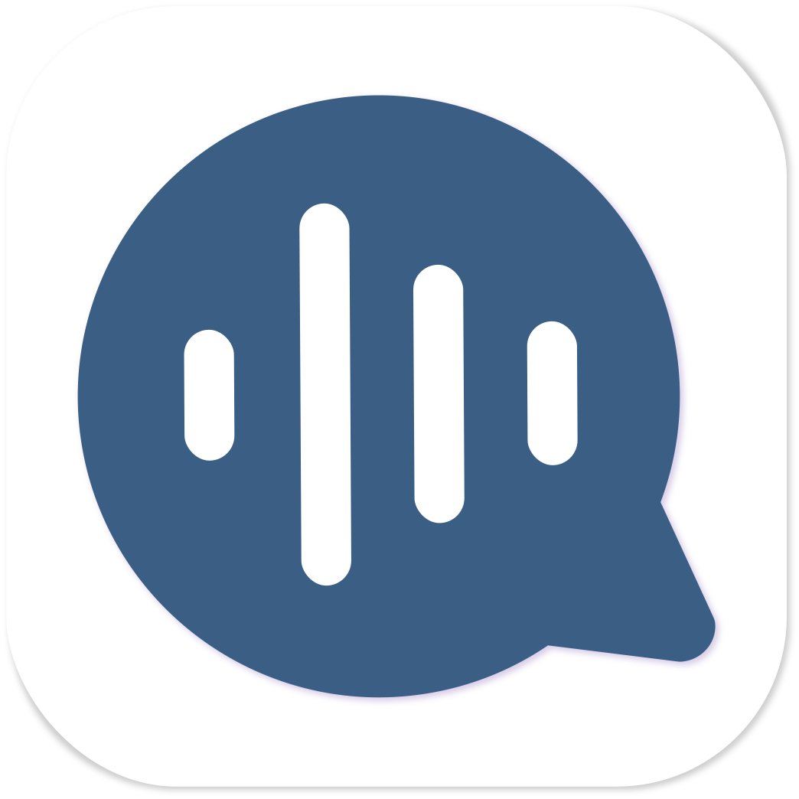

<!-- ALL-CONTRIBUTORS-BADGE:START - Do not remove or modify this section -->

<!-- ALL-CONTRIBUTORS-BADGE:END -->

  

# Goal

The purpose of this Application is to provide the global community with a non-invasive application for personal pre-screening, anywhere and anytime, through which the user can record and upload a clip of themselves or a loved-one coughing. The recorded coughs with user-provided and consented associated data will be encrypted on device to protect user privacy, and then will be uploaded to an external privacy-concerned repository to help in the detection of COVID-19 coughs by a machine-learning platform. The external repository should provide individual accounts for each user, encryption of the uploaded data, and offer a secure channel (for example OAuth2) as end-points for secure communication. All of the data sent through CoughCheck is owned by you. You own your voice and potential cough signatures. All the Application code is Open Source, you can view it, check the source code and validate our builds. We want to enforce to people the real privacy danger of recording their voices and coughs to any party without clear intentions and regulations.

The Machine-Learning module will analyze the cough and determines the likelihood that the user is infected with COVID-19 as well as the other potentially crucial meta information such as the potential severity of the infection, likelihood of accompanying health concerns, etc.

# Project Links

  - Join our [Slack channel](https://join.slack.com/t/open-covid19/shared_invite/zt-cbji2hte-8jdoHpJDKg80ZliPVCIjqw)
  - Participate using our [Public Trello board](https://trello.com/opencovid19aicoughdetectionteam)
  - Our project is kindly hosted and supported by [JOGL (Just One Giant Lab)](https://app.jogl.io/project/132)
  
# Usage

WiP

## Roadmap

### Development of MVP

The first step of this project will be to develop the Minimum Viable Product for this application and get it to market so that end-users can begin to upload data to.

  - [Figma Prototype](https://www.figma.com/file/OTTJjNQSbzJ7d9qCyLOZ9h/OpenCOVID19?node-id=0%3A1)
  - Add your own prototype...

### Data Gathering & ML Processing

The second step is to onboard as many users as feasible (both uninfected and infected individuals) and setup machine learning capabilities within the application, which processes audio clips uploaded to discern discrepancies between the coughs of an infected individuals and the coughs of an uninfected individual.

### COVID-19 Detection Application

Pivot the application to return predictions based on audio files uploaded once confidence level in ML Processing is high enough.

## Contributing

This project exists thanks to all the people who contribute. Check our general [on-boarding guide](./GETTING_INVOLVED.md)

### Developers

  - If you prefer to immediately contribute with code feel free to check [our issues page](https://github.com/OpenCOVID19CoughCheck/CoughCheckApp/issues) if you want to contribute. 
  - If you prefer [to check the contributing guide](./CONTRIBUTING.md)
  - If you have not time at all, you may still star this repository if this project can help you!

### Financial collaborators

Show your support

 Become a financial contributor and help us sustain our community through OpenCollective

  You can also donate using Liberapay

# Project Status

CoughCheckApp is being actively developed. We’re currently working on partnerships with other open source projects and support from companies and Universities around the globe.

Visit the to the ToDo list to contribute or see the features in progress.

## License

We are currently using the Open Source [MIT License](./LICENSE.md)

## TODOs

- [x] Adding `prettier` & `editorconfig` so we all have a consistent code (also husky so we are sure not breaking existing style rules with new commits)
- [x] Adding `native-base` to implement the login.
- [x] Adding a [SafeArea layout](https://reactnavigation.org/docs/handling-safe-area/)/Keyboard layouts, so we are safe for devices with notches and able to reuse in different views.
- [x] Add Authentication routes and Global Context.
- [x] Adding `oAuth2`.
- [ ] Migrate existing UI components from `react-native-paper` to `native-base` components. [Here their reasons](https://github.com/GeekyAnts/NativeBase#2-why-nativebase) to make this choice and for me mainly because **they are wider used** and they provide both [Sketch/Illustrator/Figma compatible design components](https://nativebase.io/sketch-template).
- [ ] I would change the styling approach from Object-based style to `styled-components`.
- [ ] Start adding tests with [`react-native-testing-library`](https://callstack.github.io/react-native-testing-library/docs/getting-started).

=======

Copyright © 2020 [OpenCOVID19CoughCheck Team](https://github.com/OpenCOVID19CoughCheck)

